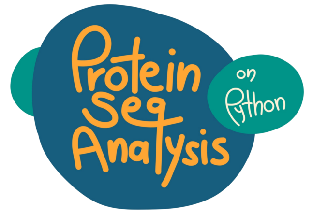

# ProteinSeqAnalysis
A python-based protein sequence analysis tool for unix command line. This program, given one query, searchs for homologues on given GenBank files using Blastp. After this, uses Muscle to make an aligment using the query and hit sequences, and also builds a neighbor-joining phylogenetic tree. Last, but not least, searchs for protein domains of interest using the Prosite database.

Multiple querys (on multifasta file) and multiple GenBank files usage supported.

## Requirements
This program requires Python 3.x, Blastp, Muscle, Biopython and Matplotlib.

## Usage
Install the program cloning the package from this GitHub repository, which contains all the program modules. Then, locate the program folder and type on the command line, for example:
```python main.py -q query.fasta -g gengenbank.gbff.txt```

## Input files
This program recieves as arguments the names of the following files:
- One query file, on FASTA format, containing the query(s) sequence(s).
- One or several GenBank files, to get the protein sequences to compare your query to.

## Oputput
The program will create three folders:
- __log__: Containing the log files of the different runs.
- __data__: Containing FASTA files with the sequences used on each run.
- __results__: With three subdirectories, where the __blastp__, __muscle__ and __prosite search__ result files will be stored.
